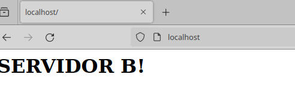
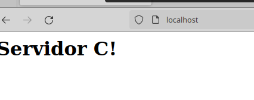

# UD4 – Implantación de soluciones de alta disponibilidad

## Tarea 2 – Balanceo de carga en Apache

El primer paso es crear 3 contenedores docker con apache2, el contenedor encargado del balanceo lo creamos con un dockerfile que lo dejamos en github para verlo y los otros 2 con la imagen oficial de apache2 en docker.

Ahora entramos dentro del contenedor encargado de hacer el balanceo y cremos un nuevo archivo de configuracion:

    # cat /etc/apache2/sites-available/load-balancer.conf
    <VirtualHost *:80>
    <Proxy balancer://mycluster>
        # Server 1
        BalancerMember http://172.17.0.3
        # Server 2
        BalancerMember http://172.17.0.4
    </Proxy>
    ProxyPass / balancer://mycluster/
    </VirtualHost>

En donde especificamos las ips de los 2 servidores web a los que le haremos el balanceo.

Ahora desabilitamos la web por defecto y habilitamos este fichero y reiniciamos el apache:

    a2dissite 000-default.conf 
    a2ensite load-balancer.conf

Para comprobar que funciona editamos el index de los 2 servidores web para distinguirlos 

Ahora probamos una configuración que sirve por si tenemos uns ervidor que puede almacenar mas peticiones que otro, por lo que en este ejemplo de cada 4 peticiones 3 irían a C y una al A:

    <VirtualHost *:80>
    <Proxy balancer://mycluster>
        # Server 1
        #BalancerMember http://172.17.0.3
        # Server 2
        #BalancerMember http://172.17.0.4
        BalancerMember http://172.17.0.3 loadfactor=1
        BalancerMember http://172.17.0.4 loadfactor=3
    </Proxy>
    ProxyPass / balancer://mycluster/
    </VirtualHost>

