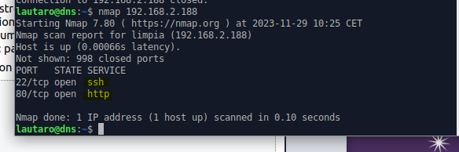
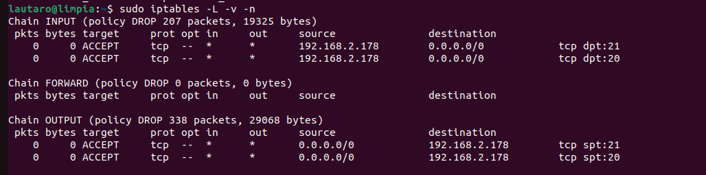

# UD3 – Instalación y configuración de cortafuegos y proxies

## Tarea 1 – Retos de cortafuegos básico

(Maquina local = lautaro@limpia
IP = 192.168.2.188)

(Maquina cliente = las demas desde las que probamos, las pruebas las hicimos casi todas con la maquina llamada dns con la ip 192.168.2.178)

Previamente hay que haber hecho un iptables-save para tener el
fichero incial:

### 1. Limpia todas las reglas al Servidor y tendremos el firewall sin ninguna regla y parado.

Con el siguiente comando lo que haces es una limpieza de las tablas (un FLUSH).

    sudo iptables -F

### 2. Mira el estado actual de las reglas con "iptables -L -v -n".

    sudo iptables -L -v -n

### 3. En una otro equipo virtual Ubuntu (será "Cliente") instala el software nmap. Nos servirá para hacer escaneo de puertos y comprobar si se puede acceder a los servicios del servidor de nuestro compañero y el nuestro.

Instalamos nmap y luego hacemos un escaneo a la ip del nuestro equipo donde estan modificando el firewall.
Podemos ver que tenemos todos los puertos cerrados ya que hicimos el flush y borramos todas las reglas.

Hicimos el namp a otra maquina  y en un principio vemos que todos los puertos estan cerrados  pero luego instalamos apache y vemos que tenemos el puerto visible ya que al hacer el flush y estar en ACCEPT tenemos todo libre.

### 4. Si las políticas por defecto del servidor no son ACCEPT en INPUT, OUTPUT y FORWARD, poned a todas ACCEPT.

Vemos que todas las reglas estan en ACCEPT:

### 5. Instala Apache y openssh-server en el Servidor

### 6. Comprueba que puedes ver los servicios activos desde el Cliente, accediendo con un navegador web y un cliente ssh al servidor de nuestro compañero.

### 7. Comprueba también que nmap te muestra que los puertos de los servicios web y sshd están abiertos (escuchando).

### 8. Ahora cambia la configuración del firewall para cerrar el acceso al servidor. Pon en iptables que la política en INPUT, OUTPUT y FORWARD sea por defecto DROP. Comprueba el estado actual del firewall.

### 9. Desde el cliente comprueba que los puertos de los servicios ya no son accesibles y tampoco se puede acceder con los clientes web y ssh. Comprueba que tampoco puedes acceder desde el servidor en la red, haciendo un ping al cliente.

### 10. Permite el acceso a la máquina server solo desde la dirección IP de la máquina cliente del compañero a cualquier protocolo (recuerda, hay que activar la petición y la respuesta).

### 11. Comprueba que no se puede acceder por ejemplo desde nuestro cliente (ping, cliente web) a nuestro propio servidor, y un scan con nmap te dará todos los puertos cerrados. En cambio desde el cliente del compañero se tiene que poder.

### 12. Permite el acceso a la máquina servidor solo a los puertos de los servicios Web (80, 443) y SSH (22), desde cualquier equipo, y prueba que ahora desde el cliente del compañero puedes acceder a los servicios web y ssh, pero que no puedes hacer un ping, por ejemplo. Comprueba también con nmap

Vemos que no podemos hacer ping:

### 13. Prueba a poner solo la regla de la cadena INPUT. ¿Funciona el servicio web? ¿Por qué?

Obviamente el servicio web no funciona porque debemos dar tambien la regla output para que funcione.

### 14. Permite hacer ping a la máquina servidor (busca los icmp-type del ping), desde el cliente del compañero, y prueba que ahora desde el tuyo si puedes hacer ping.

### 15. Si queremos denegar que se pueda hacer un ping, ¿tendremos que hacer dos reglas INPUT y OUTPUT o solo con INPUT ya denegamos? ¿Por qué?

Para denegar que se pueda hacer ping solo necesitamos una regla  INPUT. No es necesario crear una regla específica OUTPUT.

    lautaro@limpia:~$ sudo iptables -A INPUT -p icmp --icmp-type echo-request -j DROP

### 16. Activa ahora el servicio FTP del servidor y limita el acceso al servidor FTP al cliente de tu compañero.

1. Piensa que el protocolo FTP usa 2 puertos, el 20 y el 21 (en modo activo).
2. Prueba primero a permitir el puerto de comandos (21) y después si funciona, abre el
puerto de datos (20).
3. Para entender como funciona el modo activo y pasivo de FTP
https://slacksite.com/other/ftp.html#activo.

Instalamos ftp.

Damos los premisos.

Y vemos que podemos conectarnos.

### 17. Comprueba desde tu cliente que no se puede acceder a FTP pero desde el cliente del compañero sí. Mira con nmap desde los dos equipos cliente (el tuyo y el del compañero).

Vemos que desde el cliente (dns) nos pudimos conectar yd desde nuestro equipo no:

### 18. Haz que la configuración de iptables sea persistente al servidor. Comprueba reiniciando el servidor. Comprueba que las reglas iptables continúan existiendo.

Instalamos :

    sudo apt install iptables-persistent

Volvemos a aplicar las reglas y reiniciamos para ver si se quedan guardadas:

Con este metodo no nos funciono por lo que utilizamos otro metodo.

Ejecutamos  el siguiente comando para guardar la informacion de los iptables en este archivo:

    sudo sh -c 'iptables-save > /etc/iptables/rules.v4'

Luego en en creamos un archivo /etc/rc.local y le damos el siguiente contenido:

    # Cargar reglas iptables al inicio
    iptables-restore < /etc/iptables/rules.v4
    #opcional -ip6tables-restore < /etc/iptables/rules.v6

Le damos permisos de ejecución:

    sudo chmod +x /etc/rc.local

Ahora reiniciamos el sistema y probamos (debemos ejecutar el rc.local y ya se nos cargan las configuraciones antiguas.):

