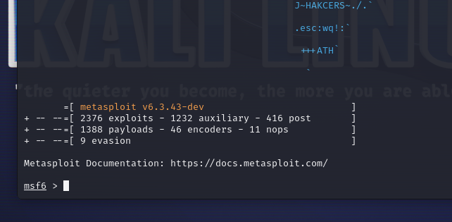
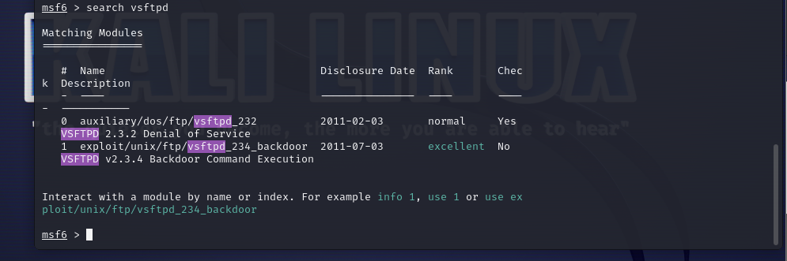
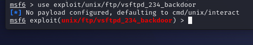
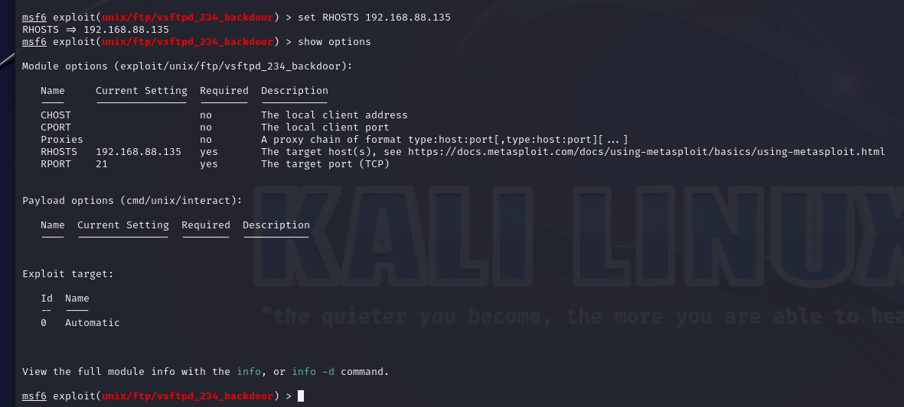
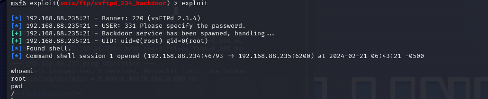
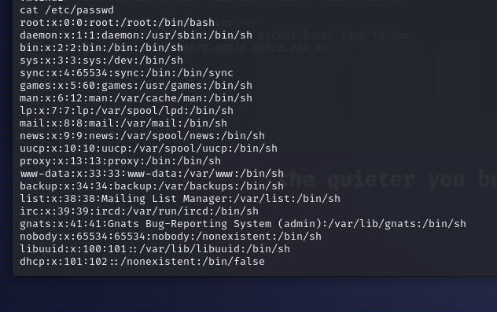
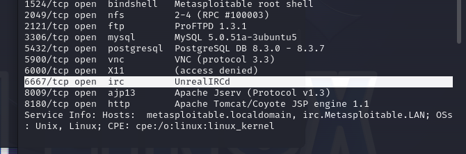
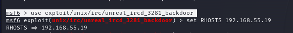
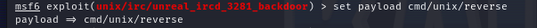
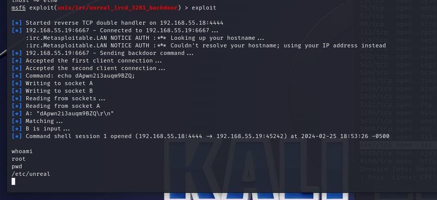

# Pentesting con Metasploitable 2

## Instala un máquina virtual Metasploitable 2 y, mediante Kali Linux, intenta aprovechar las vulnerabilidades de los servicios FTP e IRC. Realiza un breve documento explicando los pasos y mostrando capturas que demuestren cómo has conseguido vulnerar los servicios.

# FTP---

Necesitams 2 makinas virtuales, una de kali y otra de metaspoitable las que debemos tener en la misma red.

Hacemos un scaneo con nmap -sV lo cual nos muestra los servicios y sus versiones de la ip correspondiente.

Ahora vamos a utilizar Metasploit Framework para buscar y explotar la vulnerabilidad que pueda tener este servicio.

Utilizamos el comando search vsftpd para ver las vulnerabilidades que tenemos dispnibles en ese servicio:

Como vemos en el nmap teniamos abierto el servicio ftp en el puerto 21 y encontramos la vulnerabilidad tambien.
Usaremos el comando exploit:

Configuramos la ip a la que atacaremos con 'set RHOSTS' y vemos que quedo bien:

Ahora ejecutamos el exploit y vemos que se crea una shell conectada a la otra maquina con permisos de root:

Viendo que ejecutando whoami para ver quien somos nos dice que somos root y por ende tenemos control sobre todo.

Tambien podemos ver los demas usuarios por lo que ya tambien podemos intentar hackear a cada usuario.

# IRC---

Volvemos a utilizar la maquina de kali para "hackear" el metasploitable fijandonos que esten en una misma red.

Comprovamos con un nmap -Sv los servicios y puerto abiertos 

Y ejecutamos la consola de metasploitable usando el modulo de urc:

Debemos configurar el host remoto y el host local:

    msf6 exploit(unix/irc/unreal_ircd_3281_backdoor) > set RHOSTS 192.168.55.19
    RHOSTS => 192.168.55.19

    msf6 exploit(unix/irc/unreal_ircd_3281_backdoor) > set lhost eth0
    lhost => eth0

Configuramos el payload:

Executamos el exploit y vemos que todo funciono bien y estamos dentro del sistema como root:

