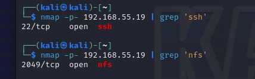
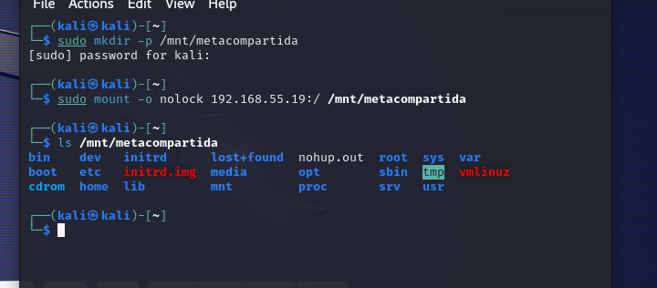
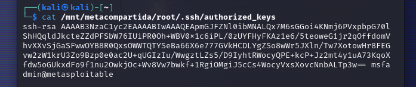
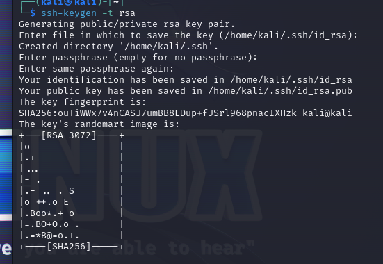
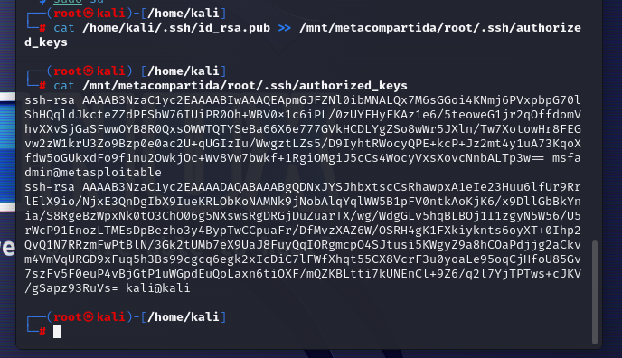
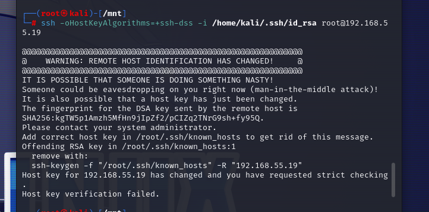
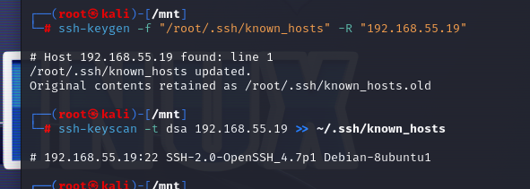
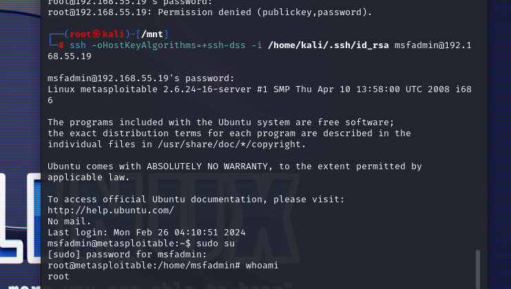

# Pentesting con Metasploitable 2 - NFS

### Mediante los conocimientos que sabíamos sobre el ssh y el acceso con certificado en lugar del acceso con contraseña y, sabiendo que Metasploitable 2 ofrece un servicio NFS que, probablemente tenga alguna vulnerabilidad, intenta acceder como root al sistema. Documenta el proceso y entrégalo en esta tarea.

Vemos haciendo un nmap que si tenemos abiertos ssh y nfc que utilizarremos para la tarea:

Ahora montamos el NFS compartido:

Una vez ya con los archivos compartidos vemos que tenemos acceso al directorio autorizado de la maquina de metasploitable.

Debemos generar una nueva clave y con la clave generada machacar la clave de metasploitable por la nueva.

Cuando probamos hacer el ssh nos dio el siguiente error:

Lo solucionamos eliminando la clave de host antigua y aplicando la nueva:

Y ya nos podemos conectar por ssh:

