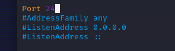
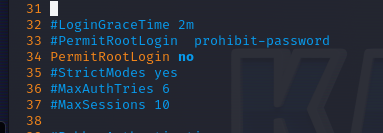
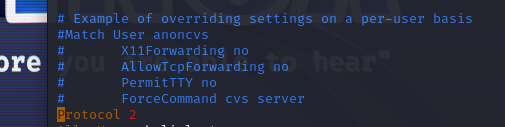
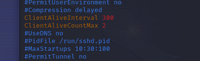
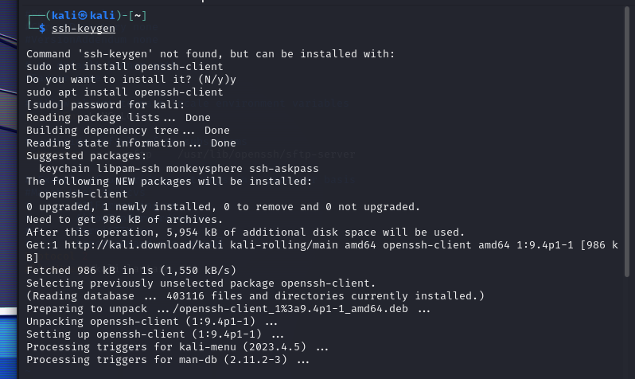
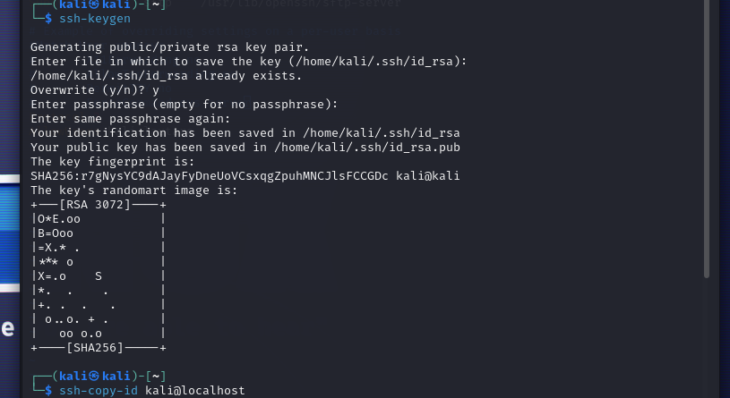
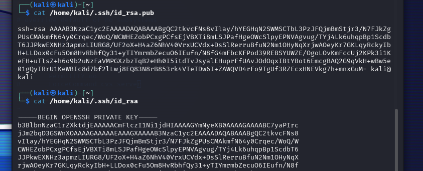

# 
 *UD2 – Mecanismos de seguridad activa y técnicas de acceso remoto* 

## Tarea 1: SSH

En la siguiente tarea vamos a instalar un servidor ssh y a configurar los aspectos relativos a la
seguridad

Ahora vamos a configurar varias opciones para hacer el servidor más seguro. Muchas de ellas las configuraremos en el fichero de configuración sshd_config. Busca las opciones correspondientes:

+ Deshabilitar passwords en blanco
    
    

+ Cambiar el puerto por defecto

+ Deshabilitar el login de root a través de ssh

+ Deshabilitar el protocolo 1 de ssh

+ Configurar un intervalo de inactividad de la sesión

+ Permitir el acceso únicamente a ciertos usuarios

---
---

Por último vamos a habilitar la forma más segura de funcionamiento. Se trata de deshabilitar el
acceso ssh mediante login y password y utilizar criptografía para validarse. El cliente debe generar
un par de claves (pública y privada) y enviar la clave pública al servidor, que la almacenará en un
fichero de configuración.
Para ello usaremos el comando ssh-keygen. Intenta averiguar el resto de la configuración.

Ejecutamos el comando y nos pide realizar la instalacion de openssh-client:

Luego de la instalacion volvemos a ejecutar el comando y generamos el par de claves.Y finalmente las copiamos al servidor:

Y aca podemos ver el par de claves:

