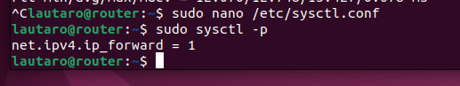
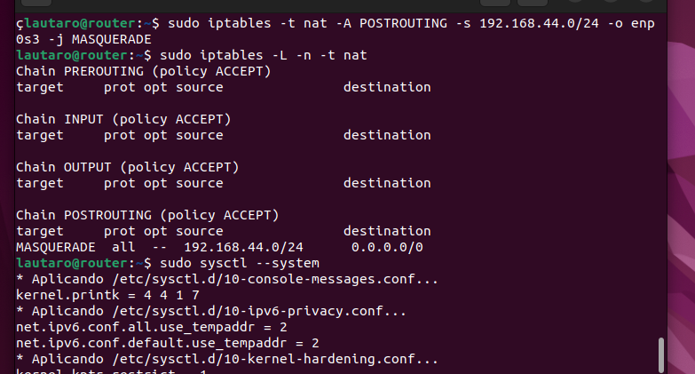
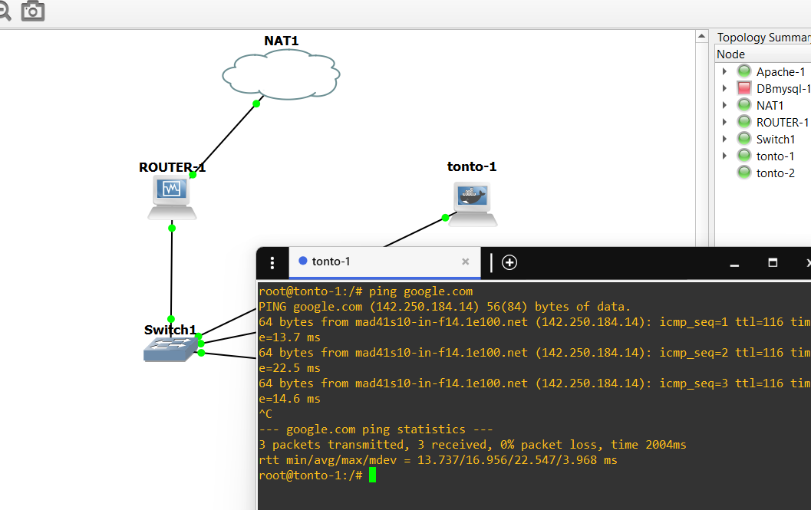
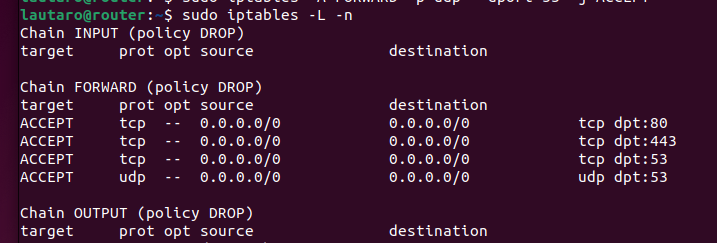
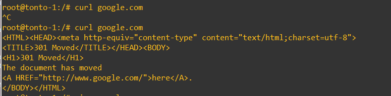
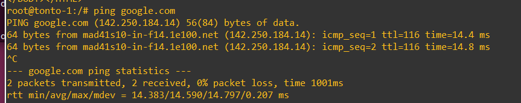
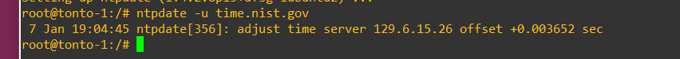
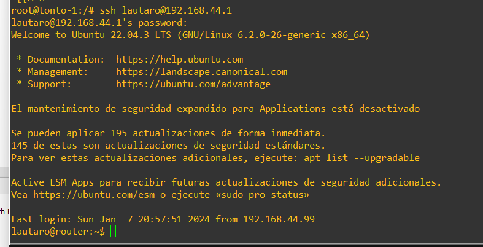
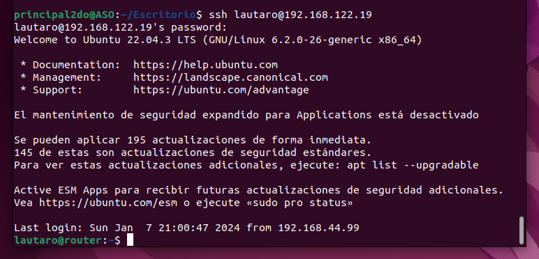

# UD3 – Instalación y configuración de cortafuegos y proxies

## Tarea 2 – Firewall entre redes

### Pasos:

Descomentar la siguiente linea del fichero /etc/sysctl.conf 
    
    #net.ipv4.ip_forward=1

Y para aplicarlo ejecutar 
    
    sudo sysctl -p

---
Con esto empezamos a configurar para enmascarar los equipos y que puedan salir a internet.

El comando que usamos es el siguiente:

    lautaro@router:~$ sudo iptables -t nat -A POSTROUTING -s 192.168.44.0/24 -o enp0s3 -j MASQUERADE

Y lo aplicamos con:

    lautaro@router:~$ sudo sysctl --system

Y comprobamos que pueden salir:

Ahora pasamos todas las reglas a DROP:
    
    lautaro@router:~$ sudo iptables -P INPUT DROP
    lautaro@router:~$ sudo iptables -P OUTPUT DROP
    lautaro@router:~$ sudo iptables -P FORWARD DROP

Ahora abrimos los puertos para permitir las consultas webs:
    
    lautaro@router:~$ sudo iptables -A FORWARD -p tcp --dport 80 -j ACCEPT
    lautaro@router:~$ sudo iptables -A FORWARD -p tcp --dport 443 -j ACCEPT

Y el puerto necesario para poder hacer uso de los dns:

    lautaro@router:~$ sudo iptables -A FORWARD -p tcp --dport 53 -j ACCEPT
    lautaro@router:~$ sudo iptables -A FORWARD -p udp --dport 53 -j ACCEPT

Ahora para que funcione lo que debemos hacer es permitir el trafico relacionado y establecido:

    lautaro@router:~$ sudo iptables -A INPUT -m state --state ESTABLISHED,RELATED -j ACCEPT
    lautaro@router:~$ sudo iptables -A FORWARD -m state --state ESTABLISHED,RELATED -j ACCEPT
    lautaro@router:~$ sudo iptables -A OUTPUT -m state --state ESTABLISHED,RELATED -j ACCEPT

Con esto vemos que ya podemos hacer consultas a paginas webs:

Para permitir el tráfico con los POP3 y IMAP abrimos los siguientes puertos:

    lautaro@router:~$ sudo iptables -A FORWARD -p tcp --dport 110 -j ACCEPT
    lautaro@router:~$ sudo iptables -A FORWARD -p tcp --dport 143 -j ACCEPT

Para permitir realizar pings :

    lautaro@router:~$ sudo iptables -A FORWARD -p icmp -j ACCEPT

Y comprobamos:

Para permitir consultas a servidores NTP:

    lautaro@router:~$ sudo iptables -A FORWARD -p udp --dport 123 -j ACCEPT

Ahora necesitamso que el equipo del administrador (192.168.44.99) sea el único que pueda conectarse por ssh al equipo router(192.168.44.1):

    lautaro@router:~$ sudo iptables -A INPUT -p tcp -s 192.168.44.99 --dport 22 -j ACCEPT
    lautaro@router:~$ sudo iptables -A OUTPUT -p tcp -d 192.168.44.99 --sport 22 -m state --state ESTABLISHED,RELATED -j ACCEPT

Y tambien el equipo de la casa del administrador se puede conectar por ssh al router:

    lautaro@router:~$ sudo iptables -A INPUT -p tcp -s 192.168.122.113 --dport 22 -j ACCEPT
    lautaro@router:~$ sudo iptables -A OUTPUT -p tcp -d 192.168.122.113 --sport 22 -m state --state ESTABLISHED,RELATED -j ACCEPT

El administrador de la red debe poder acceder desde su casa por SSH al router, a su equipo
dentro de la LAN y a los 3 servidores.

    
    lautaro@router:~$ sudo iptables -t nat -A PREROUTING -p tcp --dport 2222 -j DNAT --to-destination 192.168.44.99:22
    lautaro@router:~$ sudo iptables -t nat -A PREROUTING -p tcp --dport 2233 -j DNAT --to-destination 192.168.44.200:22
    lautaro@router:~$ sudo iptables -t nat -A PREROUTING -p tcp --dport 2244 -j DNAT --to-destination 192.168.44.88:22

El servidor web debe estar accesible desde cualquier equipo del exterior (aunque sólo
podemos probar las conexiones http, crearemos también la regla para permitir https).

    lautaro@router:~$ sudo iptables -t nat -A PREROUTING -p tcp --dport 80 -j DNAT --to-destination 192.168.44.88:80
    
    lautaro@router:~$ sudo iptables -t nat -A PREROUTING -p tcp --dport 443 -j DNAT --to-destination 192.168.44.88:443
    
    lautaro@router:~$ sudo iptables -A FORWARD -p tcp --dport 80 -d 192.168.44.88 -j ACCEPT
    
    lautaro@router:~$ sudo iptables -A FORWARD -p tcp --dport 443 -d 192.168.44.88 -j ACCEPT

El servidor web podrá realizar consultas al servidor que tiene la base de datos ya que estan en la misma red.

    

