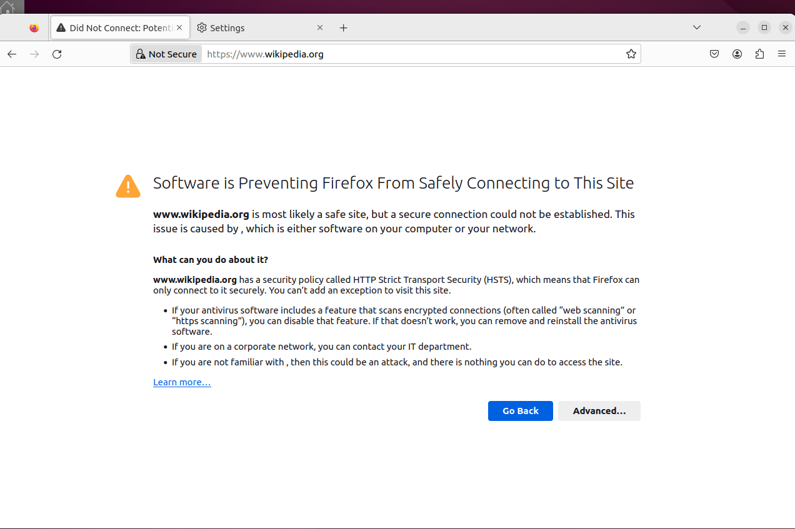
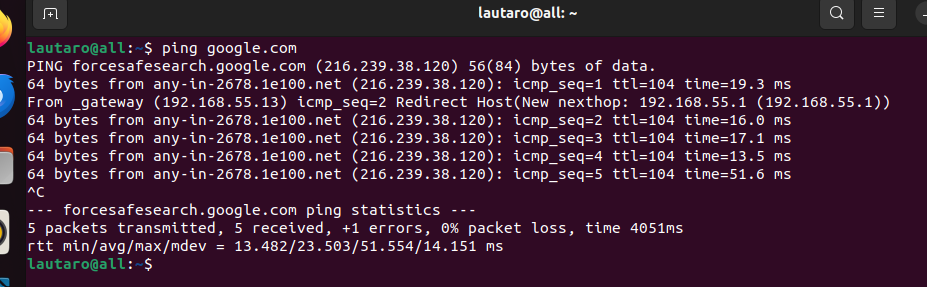

# UD3 – Instalación y configuración de cortafuegos y proxies

## Tarea 5 – Configuración de Squid como proxy transparente

1. Hacer que squid funcione como proxy transparente sin problemas con el acceso de
los clientes al protocolo HTTPS

Generamos la clave privada:
    
    /etc/ssl/squid$ sudo openssl genrsa -out /etc/ssl/squid/squid.private 2048

Generamos una solicitud de firmado del certificado:

    /etc/ssl/squid$ sudo openssl req -new -key squid.private -out squid.csr

Firmamos la solicitud:

    /etc/ssl/squid$ sudo openssl x509 -req -days 3652 -in squid.csr -signkey squid.private -out squid.cert

    Certificate request self-signature ok
    subject=C = ES, ST = Valencia, L = Paiporta, O = ASIR, emailAddress = lorcalautaro63@gmail.com

Necesitamos configurar su caché de certificados y indicamos donde almacenar la cache.

    lautaro@squid:/etc/ssl$ sudo /usr/lib/squid/security_file_certgen -c -s /var/lib/ssl_db -M 4MB

    Initialization SSL db...
    Done

Cambiamos el dueño del cache del certificado:

    /etc/ssl/squid$ sudo chown proxy:proxy /var/lib/ssl_db/

Y añadimos la siguiente configuración a squid.conf:
    
    #       WELCOME TO SQUID 5.7
    # Squid listen Ports
    http_port 192.168.55.13:3128 transparent

    # SSL Bump Config
    https_port 192.168.55.13:3129 intercept ssl-bump generate-host-certificates=on dynamic_cert_mem_cache_size=4MB cert=/etc/ssl/squid/squid.cert key=/etc/ssl/squid/squid.private

    # Other configurations
    always_direct allow all
    ssl_bump server-first all
    sslproxy_cert_error allow all
    sslproxy_flags DONT_VERIFY_PEER
    sslcrtd_program /usr/lib/squid/security_file_certgen -s /var/lib/ssl_db -M 4MB sslcrtd_children 8 startup=1 idle=1

    

Configuramos el netplan del servidor y cliente para darles una ip fija.

Configuramos las iptables del servidor para que cuando el cliente pase por el se rediriga el tráfico hacía el mismo:

    sudo iptables -A PREROUTING -t nat -i enp0s3 -p tcp --dport 80 -j DNAT --to-destination 192.168.55.13:3128
    sudo iptables -A PREROUTING -t nat -i enp0s3 -p tcp --dport 443 -j DNAT --to-destination 192.168.55.13:3129

Habilitamos para poder usar el servidor como router: 

     sudo vim /etc/sysctl.conf
     sudo sysctl -p
     net.ipv4.ip_forward = 1

Creamos una red nat en VirtualBox y metemos el servidor y cliente ahí.
Editamos el netplan del router y le damos una ip fija y en el cliente realizamos lo mismo y le damos como gateway la ip del router para que sea su puerta de enlace.

Ahora vamos al cliente y lo que debemos hacer es pasar el certificado .cert del proxy y importarlo en firefox

Como vemos en la siguiente imagen el proxy transparente esta funcionando ya que nos redirige al servidor y inetnta sali pero da error al todavia no haber importado el certificado que sería lo unico que faltaría.

Tambien vemos en la siguiente imagen que al hacerle un ping a google nos dice que a traves de la gateway 55.13 lo redirige a la 55.1

