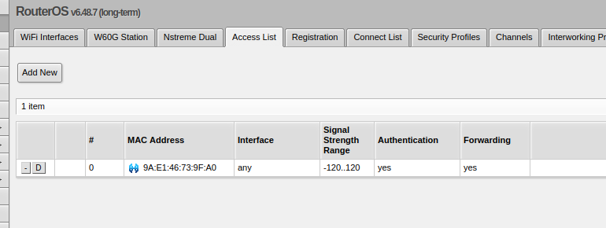

# UD3 – Instalación y configuración de cortafuegos y proxies

## Tarea 6 – Seguridad en redes inalámbricas

## Primer parte:

Vamos a hacer una lista con las MAC de nuestros móviles y/o portátiles.
Cada uno configurará una red inalámbrica en un router con un filtro por MAC que
únicamente permita conectarse a las MACs de la anterior lista. A todas excepto a la del
móvil del profesor.
 
---

Para configurar la red inalambrica entramos en wirles y ponemos la siguiente configuración para crear la red (Red Lautaro).

Luego en la sección Wirless/security profile creamos un perfil con la siguiente configuración, luego debemos indicar en la interfaz de wirless que usaremos este security profile:

Y para permitir las macs creamos una acces list con las macs necesarias:

Y con esta configuración ya tenemos hecha la configuración.
