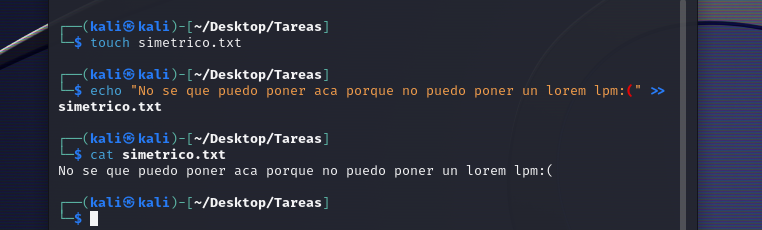
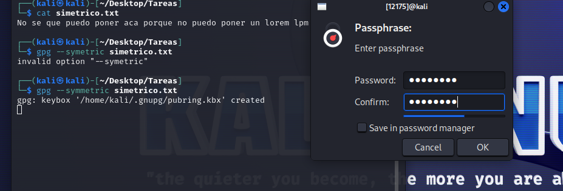
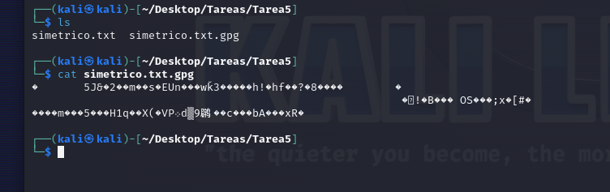
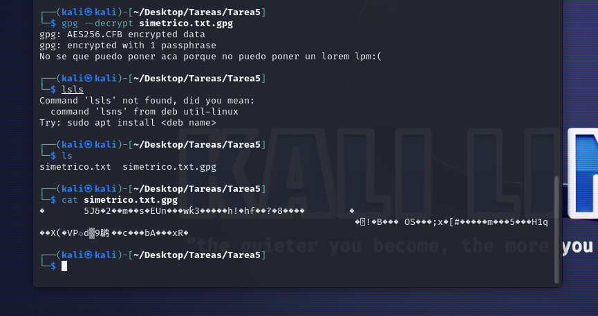
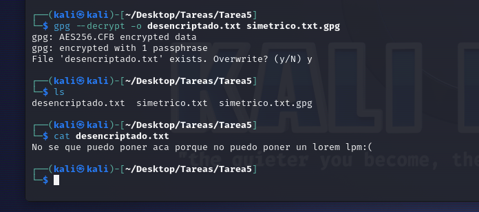

# *
UD1. Adopción de pautas de seguridad informática. Legislación 
*

## *Tarea 5 – Cifrado simétrico*

### 1. Crea un fichero de texto con un mensaje.

Creamos el fichero simetrico.txt y le introducimos el siguiente contenido:

### 2. Utiliza la orden correspondiente para encriptarlo con cifrado simétrico, sin utilizar parámetros.

Lo encriptamos y le damos una contraseña.

    gpg --symmetric simetrico.txt

### 3. Comprueba de qué tipo es el fichero que se ha generado (binario o de texto).

Vemos  que el contenido esta encriptado en binario ya que es extención gpg.

### 4. Utiliza el comando correspondiente para desencriptar el fichero. ¿El resultaodo se guarda en algún fichero?

Desencriptamos el fichero pero el contenido no se guarda en ningun fichero.

    gpg --decrypt simetrico.txt.gpg

### 5. Vuelve a realizar el paso 2, pero en este caso asegúrate de que el fichero encriptado se guarda en un fichero de texto.

### 6. Haz una captura del contenido de dicho fichero.

Desencriptamos el fichero pero con la opcion -o donde le especificamos el ficchero de salida y vemos que se guardo en un fichero de texto.

### 7. Sube a Aules el documento creado, así como los ficheros creados (el original y los encriptados). Indica en el documento la contrseña que has utilizado para que el profesor pueda desencriptarlos.

La contraseña es '45258148'