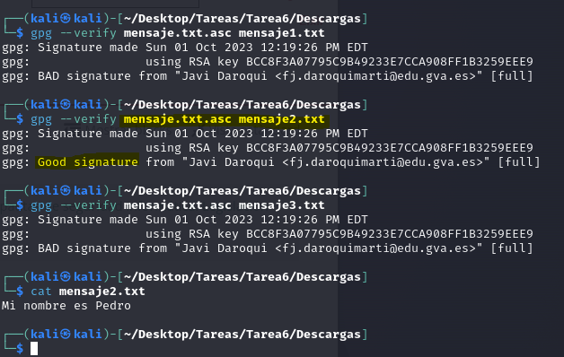

# 
 *UD1. Adopción de pautas de seguridad informática. Legislación Tarea 6 – Cifrado asimétrico y firma digital* 

## 
 * Primera parte: * 

### 1. En primer lugar, para generar el par de claves se utiliza :
    gpg --gen-key

### 2. Podemos listar las claves con el comando :
    gpg --list-keys

### e

Ese fichero ya lo podremos enviar a la persona con quien queramos comunicarnos.

### 4. Esa persona deberá importar nuestra clave pública para poder utilizarla. Se utiliza el comando:
Importamos la clave publica de Javi

    gpg --import nombre_fichero
    gpg --import Descargas/ClavePublicaJD.pub 

### 5. Creamos un fichero con un mensaje.
 
 

Para encriptar el fichero con la clave pública recién importada utilizaremos el siguiente
comando:

    gpg -v -a -o ruta/mensaje.cifrado --encrypt --recipient usuario fichero 
    gpg -v -a -o punto5.cifrado --encrypt --recipient 'Javi Daroqui' punto5.txt

 

 ### 6. Finalmente, cuando recibimos el mensaje cifrado con nuestra clave pública, podemos descifrarlo con el comando 
 
    gpg --decrypt mensaje.cifrado
    gpg --decrypt MensajeLautaro.txt.asc

### 7. Una vez visto esto podemos entender cómo funciona la firma digital. Vamos a seguir trabajando con el mensaje original. En primer lugar tenemos que crear la huella del mensaje, para lo que utilizaremos el comando:

    gpg -a --detach-sign nombre_fichero

- Cuando recibimos un fichero con su firma (como en el caso anterior) debemos usar el siguiente comando para comprobar esa firma:
    
         gpg --verify nombre_fichero.asc

### 8. Si en lugar de enviar dos ficheros, queremos enviar tanto el mensaje como la firma en el mismo fichero, podemos utilizar el comando siguiente:

    gpg -a --clearsign nombre_fichero

En este caso tendremos tanto la firma como el contenido del fichero original dentro del fichero nombre_fichero.asc. El contenido del fichero será similar a esto:

### 9. El problema de esto es que el fichero lo hemos enviado sin cifrar, es decir, cualquiera podría haberlo interceptado y haber visto el contenido. Para enviar un único fichero con el contenido y la firma, pero en formato encriptado, usaremos el siguiente comando:

    gpg -a --sign nombre_fichero

Esta vez tendremos un fichero llamado nombre_fichero.asc que contendrá tanto el
contenido del fichero original como la firma y, además, estará cifrado con nuestra clave
privada. Ya podemos enviarlo de forma segura al destinatario que queramos

## Segunda parte:
• Descarga de Aules la clave pública del profesor y el fichero de texto con su huella

• Encripta con esa clave un fichero de texto con algún mensaje

    gpg -v -a -o mensajeJavi.cifrado --encrypt --recipient 'Javi Daroqui' mensajeJavi.txt 
     

• Comprueba antes de proceder al cifrado que la huella coincide
• Sube a Aules el fichero encriptado. El profesor debería poder descifrarlo con su clave privada

## Tercera parte:

-Descarga el fichero mensaje.txt.asc de Aules. Descarga además los ficherosmensaje1.txt, mensaje2.txt y mensaje3.txt. Deberás comprobar cuál de los mensajes no ha sido modificado tras firmarlo. Escribe en un fichero llamado Ejercicio1.txt la frase que hay en el fichero correcto. Crea otro fichero con la
firma del mensaje y sube los dos ficheros a Aules

- Descarga los ficheros mensaje1.txt.asc, mensaje2.txt.asc y
mensaje3.txt.asc. Estos ficheros contienen tanto el mensaje como la firma.
Debes hacer lo mismo que en el primer ejercicio, es decir, averiguar cuál de ellos
no se ha modificado tras la firma. Escribe en un fichero llamado Ejercicio2.txt
la frase que hay en el fichero correcto. Firma el fichero de manera que se genere
otro fichero con el mensaje y la firma, ambos en el mismo fichero. Sube ese fichero
a Aules.

-• Descarga de Aules el fichero con tus iniciales y extensión .txt.asc. Se trata de
un fichero firmado por el profesor y y cifrado con tu clave pública. Debes realizar
los siguientes pasos:

• Firma la clave pública del profesor

• Descifra el fichero

• Comprueba que el mensaje no se ha modificado por el camino, es decir, que
la firma del profesor es válida

