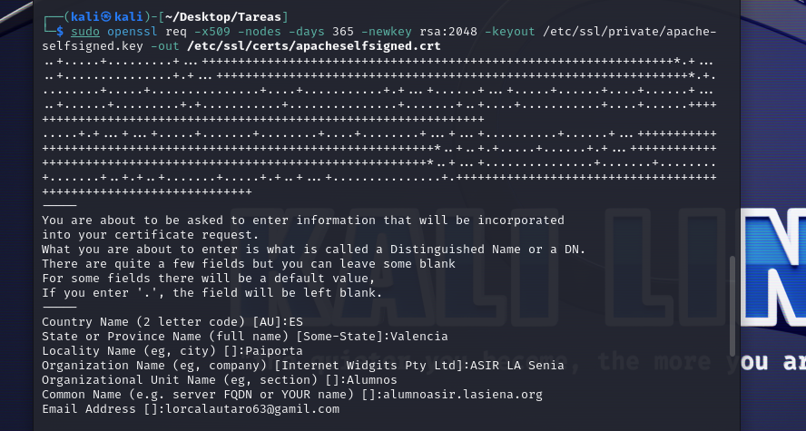
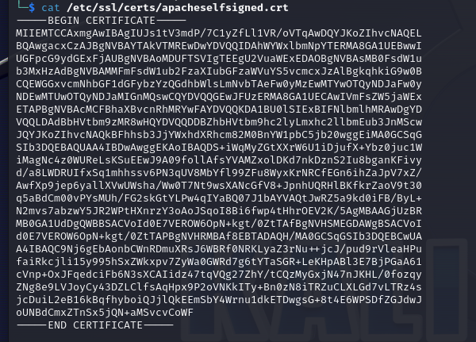

# 
 *UD1 - Adopción de pautas de seguridad informática.* 

## *Tarea 7 – Certificados SSL en Apache*

### Vamos a crear un certificado autofirmado SSL, es decir, para instalar en un servidor web.Usaremos el formato X.509. Una vez creado lo subiremos a Aules.

Simplemente tenemos que utilizar el comando openssl con una serie de parámetros:

    sudo openssl req -x509 -nodes -days 365 -newkey rsa:2048 -keyout /etc/ssl/private/apache-selfsigned.key -out /etc/ssl/certs/apacheselfsigned.crt

